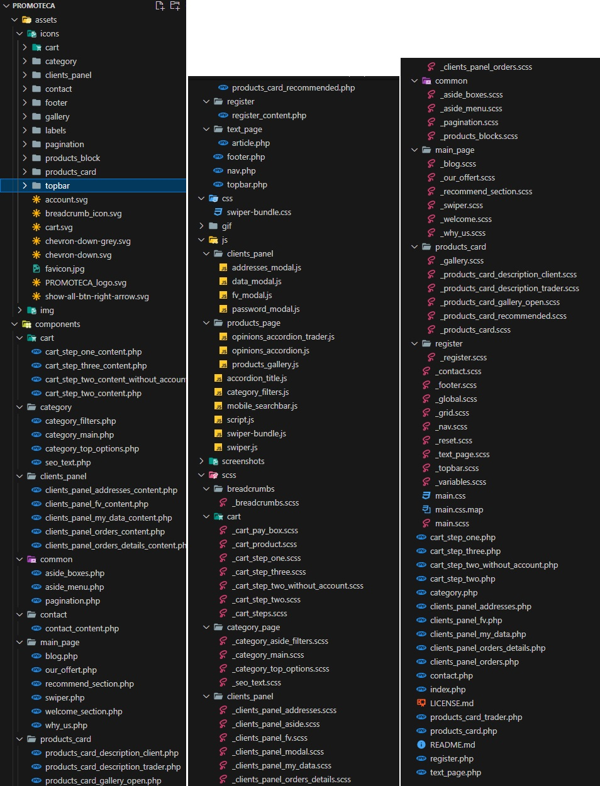
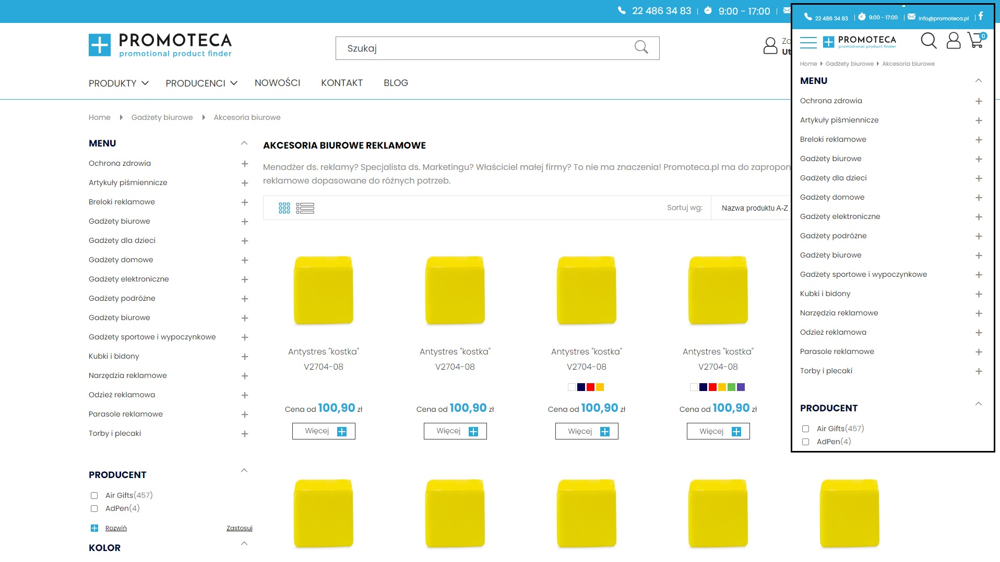
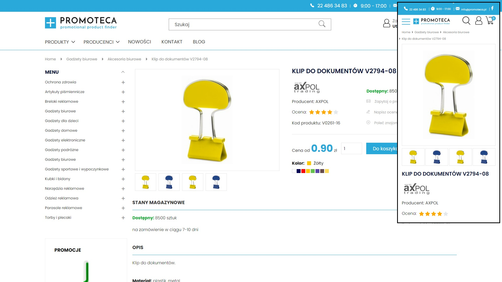
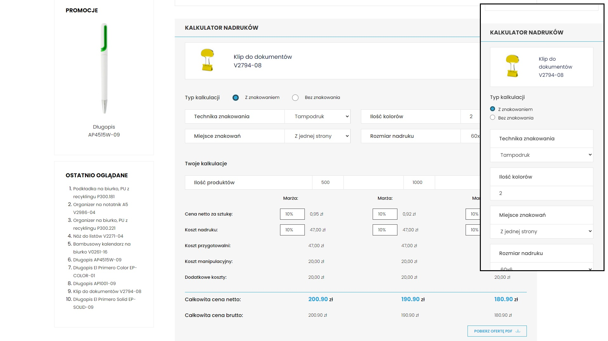
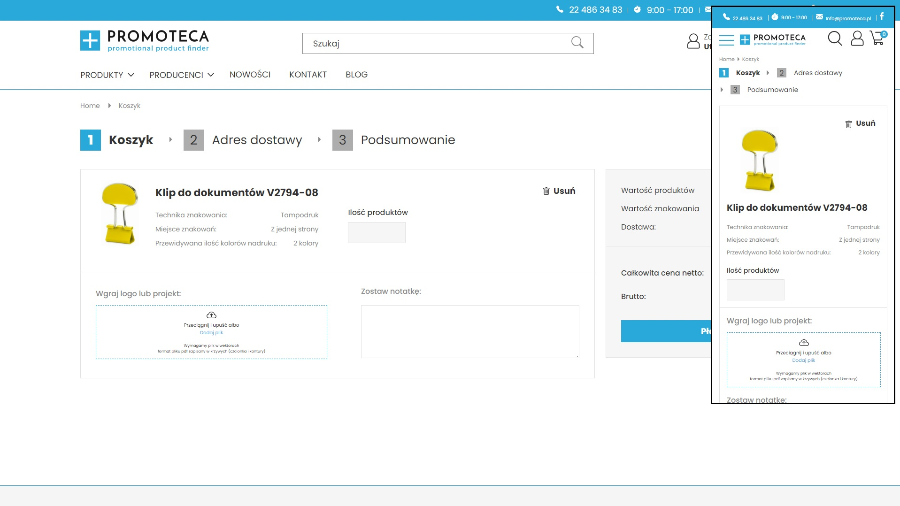
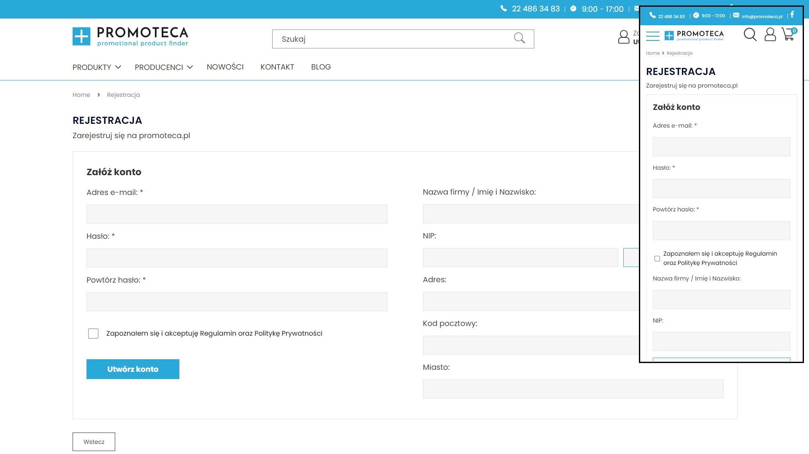
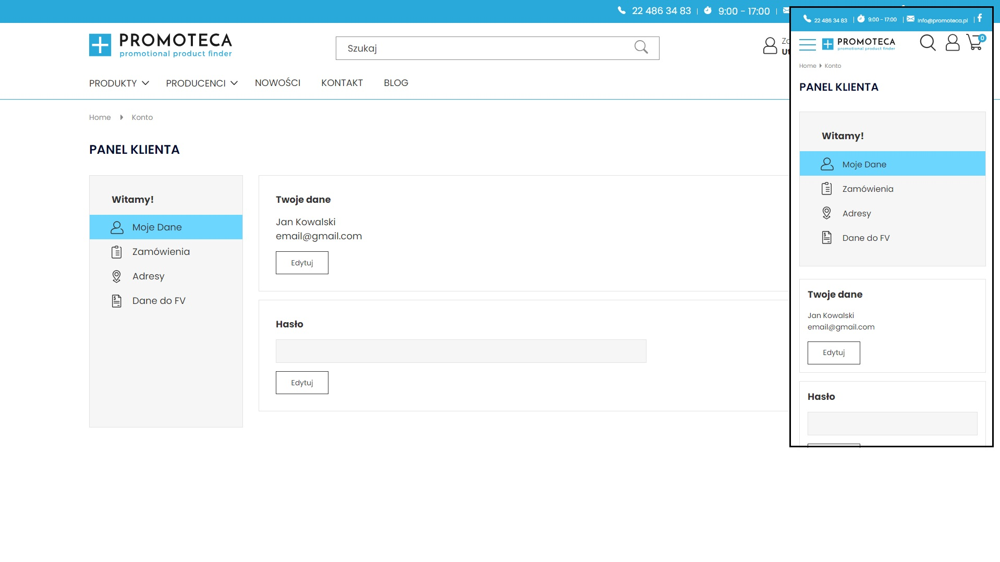
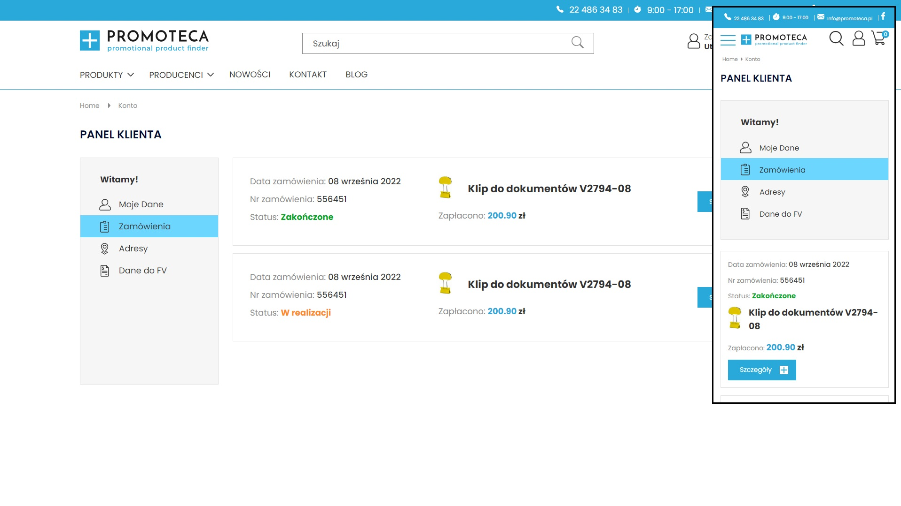
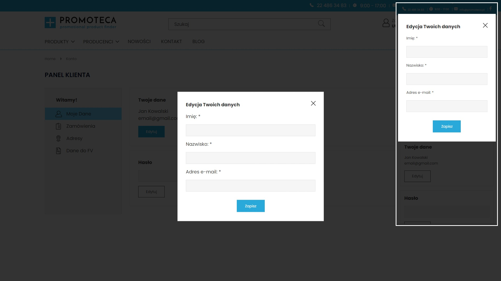

## Table of contents
* [General info](#general-info)
* [Technologies](#technologies)
* [Gif desktop website presentation](#gif-desktop-website-presentation)
* [Gif mobile website presentation](#gif-mobile-website-presentation)
* [License](#license)
* [Architecture](#architecture)
* [Screenshots](#screenshots)
## General info
PROMOTECA.pl website ➡️ E-commerce dynamic website written using PHP, SCSS, Vanilla JavaScript, HTML5 with SwiperJS. Website contains products page, cart page, login, register, offerts & account profiles/settings pages.

## Technologies   
Used technologies:
* JavaScript
* PHP
* HTML5
* SCSS

Used also:
* Swiper.js
* Lightbox.js

## Gif desktop website presentation
#### wait until the gif file loads (61,3mb)

## Gif mobile website presentation
#### wait until the gif file loads (46,8mb)

## License
License Creative Commons Non-Commercial (CC BY-NC) License 

This work is licensed under a Creative Commons Non-Commercial (CC BY-NC) License (not for commercial use)

## Architecture   

     

## Screenshots
* Desktop & mobile version :desktop_computer: :iphone:       

  

  

  

  

  

  

  

  

  